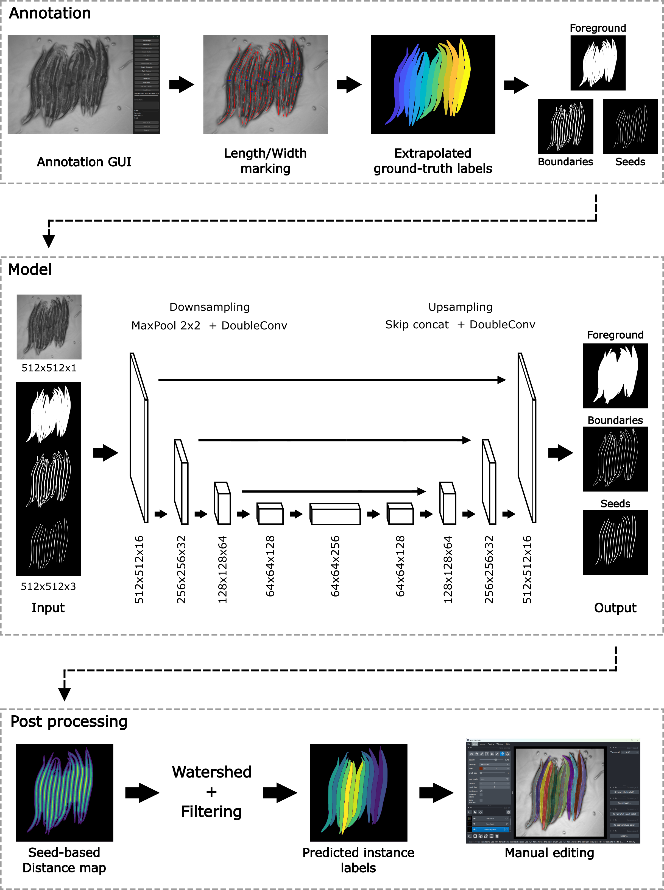

# SegBio
SegBio is a complete system for segmenting and separating long, narrow, bendy objects like C. elegans worms

## The Challenge: Slow Annotation

Instance segmentation for biomedical images is powerful, but creating the training data is a major bottleneck. Manually tracing every single worm in a clustered image is time-consuming, tedious, and scales poorly.

## Our Solution: A Hybrid, Efficient Pipeline

This pipeline is designed to maximize efficiency by combining rapid, inexact user input with powerful post-processing.

The workflow is broken into five key stages:

1. **Rapid Annotation:** Instead of fully tracing each worm, the user provides "partial" annotations (midline and width) using a custom GUI (**AnnotationGUI.exe**).
2. **Data Generation:** The simple annotations are extrapolated into a full training masks.
3. **Model Training (PyTorch):** A highly configurable U-Net (**FlexiUnet.py**) is trained to predict three separate channels from a single input image.
   The network's architecture is flexible, allowing for easy adjustment of its depth and filter count to scale the model's capacity. The model is trained to output:
   Foreground Mask: The body of the worms.
   Boundary Map: The pixels separating touching worms.
   Seed Map: A unique "center" or skeleton for each worm.
4. **Inference & Post-processing:** The 3-channel output from the U-Net is fed into a 'watershed' algorithm. The seeds mark the start of each "basin," and the boundaries act as dams allowing the watershed to robustly separate instances that are touching in the foreground mask.
5. **Human-in-the-Loop (Napari):** A final standalone GUI (**worm_editor_gui**) loads the inference results and allows the user to quickly correct any errors (e.g., merging or splitting instances).

## Key Features

* **Efficient Annotation Strategy:** Solves the "slow labeling" problem with a partial-to-full data generation pipeline.
* **Robust Instance Separation:** Uses the classic (Foreground, Boundary, Seed) + Watershed technique to reliably separate clustered instances.
* **Flexible Model:** The 'FlexiUnet.py' is parameterized for variable depth ('--depth') and filter count ('--base-filters'), making it easy to reconfigure.
* **Model Training:** Includes augmentations ('segmentor_utils.py'), a multi-channel loss function, validation splits, and checkpointing ('TrainFlexiUnet.py').
* **Automated Post-processing:** Includes an inference-time step ('postproc.py') that automatically filters and cleans the raw model output by removing small, noisy detections, and refining boundaries.
* **Standalone Inference GUI:** Provides a simple self-contained Python-based app that doesn't require any dependencies or even a python installation. Allows end-users to load their own C. elegans images, run the full segmentation pipeline, and get immediate results.

## Quickstart
* Download the standalone app from [here](https://www.dropbox.com/scl/fi/q01kcil5p79d6v9he9m5x/WormSegmentor.zip?rlkey=43cvr2h5c3svy3ka2t5d8tchs&st=lf99peps&dl=1)
* Keep the weights file (.pth) in the same folder as WormGUIApp.
* Run WormGUIApp.exe
## Tech Stack

* **Python**
* **PyTorch**
* **scikit-image** & **scipy**
* **NumPy**
* **OpenCV**
* **Napari**
* **MATLAB** & **MATLAB App Designer** (legacy annotation GUI)
