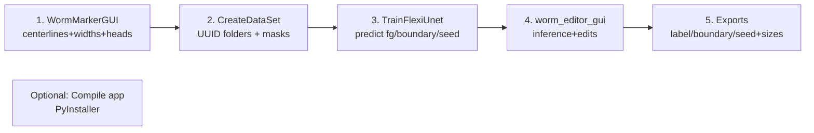

# Pipeline overview



## Step 1 — WormMarkerGUI (MATLAB annotation)

**Input:** `.tif` microscope images  
**Outputs (per image):**
- `*_measures.mat` — Nx5 cell array (centerline, width points, length, width, worm mask)
- `*_head_coords` — Nx2 head clicks used to orient head→tail

## Step 2 — CreateDataSet (build training folders)

**Input:** folder containing step-1 outputs  
**Output:** **one UUID folder per image**, containing (not all are used later):
- `box` — Nx4 bounding boxes
- `head_coords`
- `heads_mask`, `tails_mask`
- `ignore_mask` (a “neck” band to allow flexibility near head/tail boundary)
- `in` (original image)
- `out` (instance-labeled worm masks)
- `strain` (parsed from folder names; note: may be brittle)

## Step 3 — TrainFlexiUnet (PyTorch)

**Input:** 
```python
   "--root", "path/to/training data" # Path to folder with outputs of CreateDataSet.
   "--epochs", "200", # Number of training epochs 
   "--batch-size", "4" , # Number of images in training batch. Limited by GPU RAM
   "--lr", '2e-3', # Learning rate. Should scale with batch number
   "--layers", '4', # Number of layers in Unet. 4/5 works pretty well
   "--device", "cuda", # use GPU vs CPU
   "--base-filters", '32', # Width of Unet. 16/32 work pretty well
   "--save-every", "5", # Checkpoint for weights every X epochs
   "--val-split", "0.12", # Percent of data used for validation
   "--val-every", "5", # Run validation every X eps. Slower but diagnostically helpful
   "--augs-per-sample", "5", # Number of times each image is augmented in training
```
**Output:**
- `.pth` model weights
- `.csv` training metrics

## Step 4 — worm_editor_gui (Napari inference + edits)

**Inputs:**
- (optional) image path to open
- (optional) model weights path (defaults to weights in the same folder)

**Outputs:**
- `*_labels.npy` — per-worm instance mask labels
- `*_boundary.png` — boundary edit layer
- `*_seed.png` — seed edit layer
- `*_sizes.csv` — worm metrics (length, width, area, etc.)

## Optional — Compile inference app
See **Dev Guide → Compile app**.


